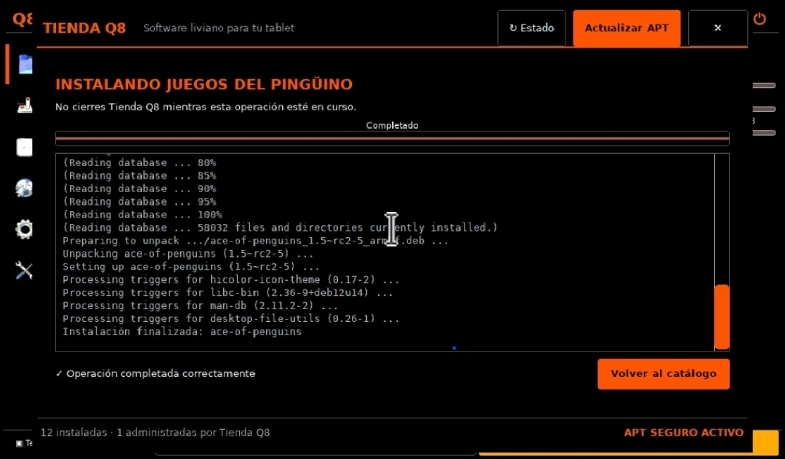

# Tienda Q8

Tienda de software ligera para la tablet Q8-A33 con Armbian/Debian Bookworm
`armhf`. La interfaz está escrita en Python/GTK3 y fue diseñada para una
pantalla táctil de 1024×600.

> **Estado:** versión 1 funcional, instalada y validada en la Q8-A33 el
> 03/09/2026. Es un componente específico de este proyecto; no pretende
> reemplazar un administrador de paquetes general.



## Funciones

- catálogo de 26 aplicaciones ligeras organizado por categorías;
- búsqueda por nombre, paquete o descripción;
- consulta del estado real mediante `dpkg-query`;
- instalación controlada de aplicaciones `armhf`;
- desinstalación exclusiva de paquetes instalados por Tienda Q8;
- actualización de las listas APT sin actualizar el sistema;
- registro visible de la operación y bloqueo de instancias simultáneas;
- integración opcional con Q8 Shell.

## Diseño de seguridad

La interfaz gráfica se ejecuta como usuario normal. Las únicas operaciones con
privilegios pasan por `tienda-q8-apt`, un ayudante instalado como `root` que:

1. acepta solamente `selftest`, `status`, `update`, `install` y `remove`;
2. limita el catálogo a 26 paquetes explícitos;
3. protege 11 componentes que forman parte del entorno Q8;
4. valida que los candidatos sean `armhf` o independientes de arquitectura;
5. simula cada instalación y bloquea actualizaciones o eliminaciones laterales;
6. simula cada desinstalación y exige que afecte solamente al paquete pedido;
7. permite desinstalar únicamente los 15 paquetes opcionales que la propia
   tienda registró en `/var/lib/tienda-q8/installed-by-store`;
8. serializa las operaciones mediante un bloqueo en `/run/lock`.

La acción **Actualizar APT** ejecuta `apt-get update`: descarga índices, pero no
instala actualizaciones.

## Archivos

| Ruta del repositorio | Destino en la tablet | Función |
|---|---|---|
| `tienda-q8.py` | `~/.local/share/tienda-q8/tienda-q8.py` | Interfaz GTK3 |
| `tienda-q8` | `~/.local/bin/tienda-q8` | Lanzador de usuario |
| `tienda-q8-apt` | `/usr/local/sbin/tienda-q8-apt` | Ayudante APT restringido |
| `tienda-q8.sudoers.example` | `/etc/sudoers.d/tienda-q8` | Autorización del ayudante |
| `INTEGRACION-Q8-SHELL.md` | — | Acceso lateral desde Q8 Shell |

## Requisitos

- Debian 12/Armbian con arquitectura nativa `armhf`;
- Python 3;
- PyGObject y GTK 3 (`python3-gi`, `gir1.2-gtk-3.0`);
- `apt`, `dpkg` y `sudo`;
- tema de iconos Adwaita y fuente DejaVu Sans.

## Instalación manual

Ejecutar desde esta carpeta con una cuenta que pueda usar `sudo`:

```bash
install -Dm755 tienda-q8.py \
  "$HOME/.local/share/tienda-q8/tienda-q8.py"
install -Dm755 tienda-q8 \
  "$HOME/.local/bin/tienda-q8"

sudo install -o root -g root -m 0755 \
  tienda-q8-apt /usr/local/sbin/tienda-q8-apt

SUDOERS_TMP=$(mktemp)
sed "s/^USUARIO_Q8 /$USER /" \
  tienda-q8.sudoers.example >"$SUDOERS_TMP"
sudo visudo -cf "$SUDOERS_TMP"
sudo install -o root -g root -m 0440 \
  "$SUDOERS_TMP" /etc/sudoers.d/tienda-q8
rm -f "$SUDOERS_TMP"

sudo -n /usr/local/sbin/tienda-q8-apt selftest
```

La última orden debe informar arquitectura `armhf`, 26 paquetes autorizados,
11 protegidos y 15 removibles.

Para abrir la aplicación:

```bash
"$HOME/.local/bin/tienda-q8"
```

## Integración con Q8 Shell

La integración probada agrega un acceso **Tienda Q8** al menú lateral y conserva
los accesos inferiores de Terminal y Teclado. El cambio exacto está documentado
en [INTEGRACION-Q8-SHELL.md](INTEGRACION-Q8-SHELL.md).

## Pruebas realizadas

En la Q8-A33 se verificó:

- rechazo de un paquete fuera del catálogo (`bash`);
- protección de un componente del entorno (`dosbox`);
- instalación de `ace-of-penguins` sin actualizar ni eliminar otros paquetes;
- desinstalación posterior afectando solamente a `ace-of-penguins`;
- limpieza correcta del registro de paquetes administrados;
- ejecución correcta de `apt-get update`;
- ausencia de operaciones pendientes en `dpkg`;
- apertura desde Q8 Shell y bloqueo de una segunda instancia.

Después de la prueba, `ace-of-penguins` quedó desinstalado y el inventario de
paquetes volvió al estado anterior.

## Capturas

- [Instalación completada](captura-instalacion.jpeg)
- [Desinstalación completada](captura-desinstalacion.jpeg)
- [Actualización APT completada](captura-actualizacion-apt.jpeg)

## Alcance

El catálogo y la lista de paquetes protegidos reflejan esta instalación Q8. Si
se adapta a otra imagen, deben revisarse antes de habilitar el ayudante. No se
deben ampliar los comandos permitidos en `sudoers`; toda validación permanece
dentro del archivo propiedad de `root`.
